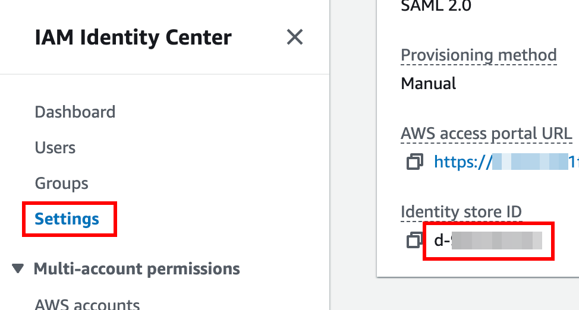
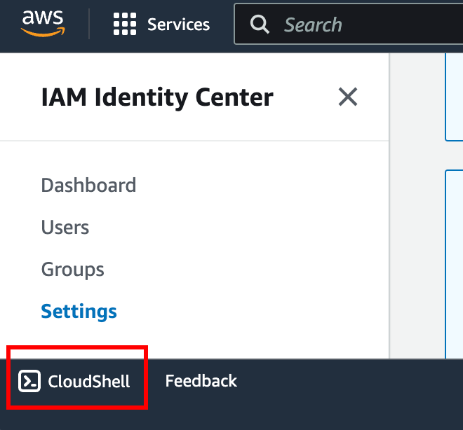

# Export AWS Identity Center users by group
## Overview
To use AWS CLI identitystore command (https://awscli.amazonaws.com/v2/documentation/api/latest/reference/identitystore/index.html#cli-aws-identitystore) to export users from AWS Identity Center

## Identity IAM Identity Store
Step 1: Login to the AWS Identity Center https://console.aws.amazon.com/singlesignon/home

Step 2: Identify the identity store ID from AWS Identity Center


Step 3: In AWS console, open up a CloudShell


### Export existing groups and memberships

Step 1: Get all users with command [list-users](https://awscli.amazonaws.com/v2/documentation/api/latest/reference/identitystore/list-users.html)

```
$ aws identitystore list-users --identity-store-id d-9667681fac --query "Users[*].UserId" 
```

Example of the outputs:
```
[
    "392a554c-4081-7032-4079-8e2ed39ec17f",
    "597aa51c-e0b1-704b-c6df-3d2ff54b3151"
]
```

Step 2: For each user IDs, get user details with command [describe-user](https://awscli.amazonaws.com/v2/documentation/api/latest/reference/identitystore/describe-user.html)

```
$ aws identitystore describe-user --identity-store-id d-9667681fac --user-id 597aa51c-e0b1-704b-c6df-3d2ff54b3151
```

Example of the outputs:
```
{
    "UserName": "richard+1@doit.com",
    "UserId": "597aa51c-e0b1-704b-c6df-3d2ff54b3151",
    "Name": {
        "FamilyName": "Kang",
        "GivenName": "Richard+1"
    },
    "DisplayName": "Richard+1 Kang",
    "Emails": [
        {
            "Value": "richard+1@doit.com",
            "Type": "work",
            "Primary": true
        }
    ],
    "IdentityStoreId": "d-9667681fac"
}
```

Step 3: For each user IDs, get group membership with command [list-group-memberships-for-member](https://awscli.amazonaws.com/v2/documentation/api/latest/reference/identitystore/list-group-memberships-for-member.html)


```
$ aws identitystore list-group-memberships-for-member --identity-store-id d-9667681fac --member-id UserId=597aa51c-e0b1-704b-c6df-3d2ff54b3151 --query "GroupMemberships[*].GroupId"
```

Example outputs:

```
[
    "59aa957c-7031-70ee-53c0-09a20cb50471",
    "093a753c-2031-70b7-83c4-7db4118b7e38"
]
```

Step 4: Get group details with command [describe-group](https://awscli.amazonaws.com/v2/documentation/api/latest/reference/identitystore/describe-group.html)

```
$ aws identitystore describe-group --identity-store-id d-9667681fac  --group-id 59aa957c-7031-70ee-53c0-09a20cb50471 --query "DisplayName"
"Developer group 1"
```

### Create users and groups in new AWS Organization

Identity the Identity Store in the new AWS Organzation from steps described in [Identity IAM Identity Store](#identity-iam-identity-store)

Step 1: Create user group with command [create-group](https://awscli.amazonaws.com/v2/documentation/api/latest/reference/identitystore/create-group.html)

Step 2: Create users with command [create-user](https://awscli.amazonaws.com/v2/documentation/api/latest/reference/identitystore/create-user.html)

Step 3: Create the relationship between user and group with command [create-group-membership](https://awscli.amazonaws.com/v2/documentation/api/latest/reference/identitystore/create-group-membership.html)